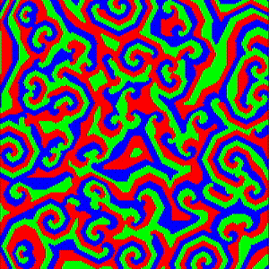

# rps-automata

A Rock–Paper–Scissors cellular automata simulation. Each cell is red, green, or blue; a cell is taken over by its predator when enough neighboring predators are present.

Configuration lives in `AppConfig` (`src/main.rs`):

| Field | Default | Description |
| --- | --- | --- |
| `grid_width` | `200` | Grid width in cells |
| `grid_height` | `200` | Grid height in cells |
| `predators_threshold` | `3` | Neighbor predators required to take over a cell |
| `sim_tick_rate_hz` | `20.0` | Simulation steps per second |

<p align="center">
  
  <br>
  <sub>Simulation output with the default configuration</sub>
</p>

## Requirements

- [Rust](https://www.rust-lang.org/tools/install) (2024 edition)

## Run

```bash
cargo run --release
```

## Tests

```bash
cargo test
```
